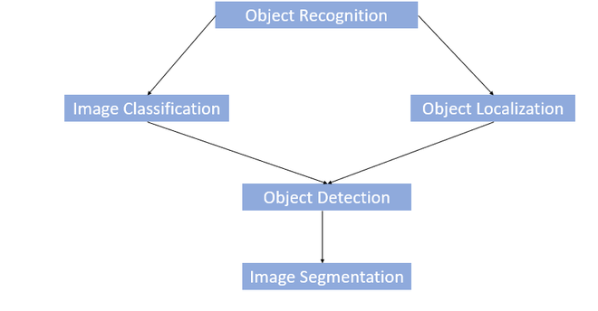

# Object Recognition

#  Contents
-  [ **Object Recognition**](#anabaslik2)
    -  [What is an image classification task?](#paragraph39)
    -   [What is an object localization task?](#paragraph40)
    -  [What is an object detection task?](#paragraph41)
    -  [What is an object recognition task?](#paragraph42)
    -   [What is bounding box regression?](#paragraph43)
    -   [What is non-max suppression?](#paragraph44)

### What is an image classification task?
It involves the extraction of information from an image and then associating the extracted information to one or more class labels. Image classification within the machine learning domain can be approached as a supervised learning task.

Image classification, at its very core, is the task of assigning a label to an image from a predefined set of categories. Practically, this means that our task is to analyze an input image and return a label that categorizes the image. The label is always from a predefined set of possible categories.

For example, let’s assume that our set of possible categories includes:

                   categories = {cat,dog,panda}
    
Then we present the following image to our classification system:

Our goal here is to take this input image and assign a label to it from our **categories set** — in this case, **dog**.

Our classification system could also assign multiple labels to the image via probabilities, such as dog: 95%; cat: 4%; panda: 1%.

More formally, given our input image of W×H pixels with three channels, Red, Green, and Blue, respectively, our goal is to take the W×H×3 = N pixel image and figure out how to correctly classify the contents of the image.

-   **Image Classification**: Predict the type or class of an object in an image.
    -   _Input_: An image with a single object, such as a photograph.
    -   _Output_: A class label (e.g. one or more integers that are mapped to class labels).
   
### What is an object localization task?
Image classification involves predicting the class of one object in an image. Object localization refers to identifying the location of one or more objects in an image and drawing bounding boxes around their extent. Object detection combines these two tasks and localizes and classifies one or more objects in an image.

(Image classification(Görüntü sınıflandırma), bir görüntüdeki bir nesnenin sınıfını tahmin etmeyi içerir. Object localization(Nesne yerelleştirme), bir görüntüdeki bir veya daha fazla nesnenin konumunu belirleme ve boyutlarının etrafına bol miktarda kutu çizme anlamına gelir. Object detection(Nesne algılama) bu iki görevi birleştirir ve bir görüntüdeki bir veya daha fazla nesneyi yerelleştirir ve sınıflandırır.)

The task of object localization is to predict the object in an image as well as its boundaries. The difference between object localization and object detection is subtle. Simply, object localization aims to locate the main (or most visible) object in an image while object detection tries to find out all the objects and their boundaries.

(Nesne lokalizasyonunun görevi, bir görüntüdeki nesneyi ve sınırlarını tahmin etmektir. Nesne yerelleştirme ve nesne algılama arasındaki fark çok incedir. Basitçe, nesne yerelleştirme bir görüntüdeki ana (veya en görünür) nesneyi bulmayı amaçlarken nesne algılama tüm nesneleri ve sınırlarını bulmaya çalışır.)

-   **Object Localization**: Locate the presence of objects in an image and indicate their location with a bounding box.
    -   _Input_: An image with one or more objects, such as a photograph.
    -   _Output_: One or more bounding boxes (e.g. defined by a point, width, and height).
 
### What is an object detection task? 
Object detection is a computer vision technique that identifies and locates objects within an image or video. Specifically, object detection draws bounding boxes around these detected objects, which allow us to locate where said objects are in (or how they move through) a given scene.

Object detection is commonly confused with image recognition, so before we proceed, we must clarify the distinctions between them.

Image recognition assigns a label to an image. A picture of a dog receives the label “dog”. A picture of two dogs still receives the label “dog”. On the other hand, object detection draws a box around each dog and labels the box “dog”. The model predicts where each object is and what label should be applied. In that way, object detection provides more information about an image than recognition.

-   **Object Detection**: Locate the presence of objects with a bounding box and types or classes of the located objects in an image.
    -   _Input_: An image with one or more objects, such as a photograph.
    -   _Output_: One or more bounding boxes (e.g. defined by a point, width, and height), and a class label for each bounding box.
   
 
### What is an object recognition task?
Object recognition is a general term to describe a collection of related computer vision tasks that involve identifying objects in digital photographs.

We will be using the term object recognition broadly to encompass both image classification (a task requiring an algorithm to determine what object classes are present in the image) as well as to object detection (a task requiring an algorithm to localize all objects present in the image.)

Object Recognition is responding to the question "What is the object in the image" Whereas, Object detection is answering the question "Where is that object"?

(Nesne Tanıma, "Görüntüdeki nesne nedir" sorusuna yanıt verirken Nesne algılama, "O nesne nerede" sorusuna yanıt verir)

-   _input_: an image containing unknown object(s)
    
    Possibly, the position of the object can be marked in the input, or the input might be only a clear image of (not-occluded) object.
    
-   _output_: position(s) and label(s) (names) of the objects in the image.

### What is bounding box regression?
Bounding-box regression is a popular technique to refine or predict localization boxes in recent object detection approaches. Typically, bounding-box regressors are trained to regress from either region proposals or fixed anchor boxes to nearby bounding boxes of predefined target object classes.

### What is non-max suppression?
Non Maximum Suppression (NMS) is a technique used in many computer vision algorithms. It is a class of algorithms to select one entity (e.g. bounding boxes) out of many overlapping entities. The selection criteria can be chosen to arrive at particular results. Most commonly, the criteria are some form of probability number along with some form of overlap measure (e.g. IOU).

Most object detection algorithms use NMS to whittle down a large number of detected rectangles to a few. At the most basic level, most object detectors do some form of windowing. Many, thousands, windows of various sizes and shapes are generated either directly on the image or on a feature of the image. These windows supposedly contain only one object, and a classifier is used to obtain a probability/score for each class. Once the detector outputs a large number of bounding boxes, it is necessary to pick the best ones. NMS is the most commonly used algorithm for this task. In essence, it is a form of clustering algorithm.

(Çoğu nesne algılama algoritması, çok sayıda algılanan dikdörtgeni birkaç taneye indirgemek için NMS kullanır. En temel düzeyde, çoğu nesne dedektörü bir tür pencereleme yapar. Çeşitli boyut ve şekillerde çok sayıda, binlerce pencere ya doğrudan görüntü üzerinde ya da görüntünün bir özelliği üzerinde oluşturulur. Bu pencerelerin yalnızca bir nesne içerdiği varsayılır ve her sınıf için bir olasılık/puan elde etmek için bir sınıflandırıcı kullanılır. Dedektör çok sayıda sınırlayıcı kutu çıkardığında, en iyilerini seçmek gerekir. NMS, bu görev için en yaygın kullanılan algoritmadır. Özünde, kümeleme algoritmasının bir şeklidir.)

